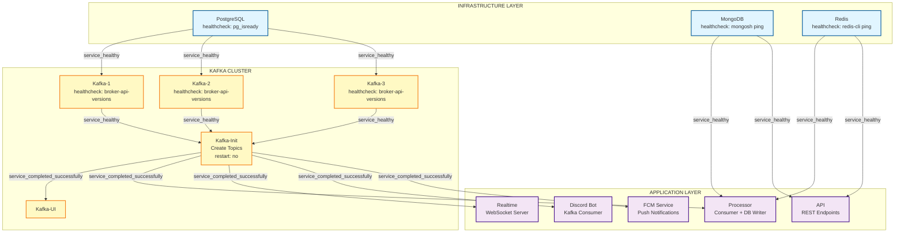

## Service Startup Timeline

```
Time  | Layer              | Services                           | Status
------|--------------------|------------------------------------|------------------
0s    | Infrastructure     | postgres, mongodb, redis           | Starting...
5s    | Infrastructure     | postgres, mongodb, redis           | Health checking...
10s   | Infrastructure     | postgres, mongodb, redis           | ✅ Healthy
      |                    |                                    |
10s   | Kafka Cluster      | kafka-1, kafka-2, kafka-3          | Starting...
20s   | Kafka Cluster      | kafka-1, kafka-2, kafka-3          | Health checking...
30s   | Kafka Cluster      | kafka-1, kafka-2, kafka-3          | ✅ Healthy
      |                    |                                    |
30s   | Kafka Init         | kafka-init                         | Creating topics...
35s   | Kafka Init         | kafka-init                         | ✅ Completed
      |                    |                                    |
35s   | Kafka UI           | kafka-ui                           | Starting...
40s   | Kafka UI           | kafka-ui                           | ✅ Running
      |                    |                                    |
35s   | Applications       | processor, api, realtime           | Starting...
35s   | Applications       | discord-bot, fcm                   | Starting...
40s   | Applications       | All apps                           | ✅ Running
```

## Dependency Matrix

| Service      | postgres | mongodb | redis | kafka-1 | kafka-2 | kafka-3 | kafka-init |
|--------------|----------|---------|-------|---------|---------|---------|------------|
| kafka-1      | ✅ (H)   | -       | -     | -       | -       | -       | -          |
| kafka-2      | ✅ (H)   | -       | -     | -       | -       | -       | -          |
| kafka-3      | ✅ (H)   | -       | -     | -       | -       | -       | -          |
| kafka-init   | -        | -       | -     | ✅ (H)  | ✅ (H)  | ✅ (H)  | -          |
| kafka-ui     | -        | -       | -     | -       | -       | -       | ✅ (C)     |
| processor    | -        | ✅ (H)  | ✅ (H)| -       | -       | -       | ✅ (C)     |
| api          | -        | ✅ (H)  | ✅ (H)| -       | -       | -       | -          |
| realtime     | -        | -       | -     | -       | -       | -       | ✅ (C)     |
| discord-bot  | -        | -       | -     | -       | -       | -       | ✅ (C)     |
| fcm          | -        | -       | -     | -       | -       | -       | ✅ (C)     |

**Legend:**
- ✅ (H) = depends_on with `condition: service_healthy`
- ✅ (C) = depends_on with `condition: service_completed_successfully`
- `-` = No dependency

## Port Mapping

```
External Port → Internal Port
─────────────────────────────────
    3000      →     3000         API Service
    5000      →     3000         Realtime WebSocket
    8080      →     8080         Kafka UI
   19092      →    19092         Kafka-1 External
   29092      →    29092         Kafka-2 External
   39092      →    39092         Kafka-3 External
   27017      →    27017         MongoDB
```

## Service Communication Flow

```
┌─────────────┐
│ External    │
│ Clients     │
└──────┬──────┘
       │
       ├──── :3000 ────→ API ──────────┐
       │                               ↓
       ├──── :5000 ────→ Realtime      MongoDB
       │                   ↑           Redis
       └──── :8080 ────→ Kafka UI      ↑
                           ↑           │
                      Kafka Cluster ───┤
                           ↑           │
                           │           │
                    ┌──────┴───────────┴─────┐
                    │                        │
              Processor ←─── Logs ───→ Discord Bot
                                           FCM
```

## Healthcheck Details

### PostgreSQL
```bash
pg_isready -U longgggwww
interval: 10s | timeout: 5s | retries: 5
```

### MongoDB
```bash
mongosh --eval "db.adminCommand('ping')"
interval: 10s | timeout: 5s | retries: 5
```

### Redis
```bash
redis-cli ping
interval: 10s | timeout: 5s | retries: 5
```

### Kafka Brokers
```bash
kafka-broker-api-versions.sh --bootstrap-server localhost:9092
interval: 10s | timeout: 10s | retries: 10 | start_period: 30s
```

## Volume Persistence

```
Volume Name      | Mount Point              | Used By
─────────────────|─────────────────────────|──────────
postgres_data    | /var/lib/postgresql/data | postgres
mongodb_data     | /data/db                 | mongodb
redis_data       | /data                    | redis
```

## Network: kafka-network

All services are connected to the same bridge network for internal communication.

```
Bridge Network: kafka-network
├── postgres     (kafka-network)
├── mongodb      (kafka-network)
├── redis        (kafka-network)
├── kafka-1      (kafka-network)
├── kafka-2      (kafka-network)
├── kafka-3      (kafka-network)
├── kafka-init   (kafka-network)
├── kafka-ui     (kafka-network)
├── processor    (kafka-network)
├── api          (kafka-network)
├── realtime     (kafka-network)
├── discord-bot  (kafka-network)
└── fcm          (kafka-network)
```
